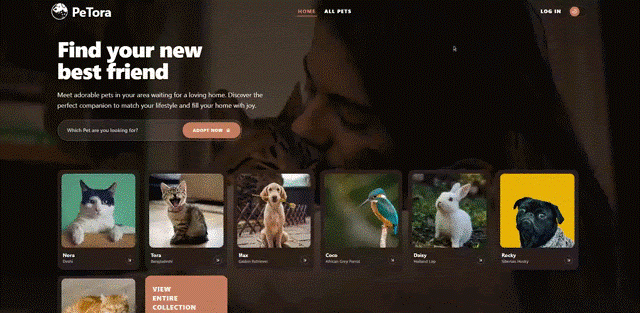

  

---

# Hi, I am Nahin Ahmed 

**Junior Full Stack Developer** focused on building responsive, production ready web applications with React.js, Next.js, JavaScript, Tailwind CSS, Node.js, Express.js and MongoDB.

---

## About Me

- I build complete web applications — authentication flows, REST APIs, dashboards, CRUD operations, and responsive UIs
- I am currently deepening expertise in **Next.js 15 App Router**, **TypeScript**, **backend API security** and **AI-assisted development workflows**
- Open to **Junior Frontend**, **Junior MERN Stack**, and **Internship** roles remote or on-site

---

## Tech Stack

**Frontend:**
React.js · Next.js 15 · JavaScript (ES6+) · HTML5 · CSS3 · Tailwind CSS · DaisyUI · HeroUI · Framer Motion · Responsive Design

**Backend & Database:**
Node.js · Express.js · MongoDB · REST API Design · JWT Authentication · BetterAuth · Google OAuth · CRUD Operations

**Tools & Deployment:**
Git · GitHub · Vercel · VS Code · npm · Figma · Netlify 

**AI & Productivity:**
ChatGPT · Gemini · Claude · Cursor · AI-assisted debugging · documentation support · test-case planning

---

## Featured Projects

| Project & Preview | Description | Tech Stack | Links |
| :--- | :--- | :--- | :--- |
| **Petora**     | <ul><li>Built a full stack pet adoption platform with dynamic listings, real time search and filter by species, age, and location, and a personalized user dashboard for managing pet listings with Add, Edit, and Delete functionality.</li><li>Implemented an adoption request system with end to end status tracking (Pending / Approved / Rejected), giving both adopters and owners clear visibility over each request through dedicated dashboard views.</li><li>Secured the platform with email/password and Google OAuth, JWT and JWK based token verification and protected routes to control access across user and owner flows.</li></ul> | Next.js, React.js, Node.js, Express.js, MongoDB, JWT, Tailwind CSS, BetterAuth, HeroUI, Framer Motion | [Live](https://petora-client.vercel.app)   [Client](https://github.com/nahin113/Petora-A-Full-Stack-Pet-Adoption-Platform)   [Server](https://github.com/nahin113/PeTora-server) |
| **Roamly**     | <ul><li>Built a full stack travel booking platform where users can explore destinations, browse travel packages, and complete bookings with real time database updates through a clean and responsive interface.</li><li>Developed full CRUD operations for travel package management with dynamic destination pages, allowing owners to add, edit, and delete listings seamlessly.</li><li>Implemented email/password and Google OAuth authentication with JWT secured protected routes and conditional navbar UI based on authentication state.</li></ul> | Next.js, React.js, Node.js, Express.js, MongoDB, JWT, Tailwind CSS, BetterAuth, HeroUI | [Live](https://roamly-destinations.vercel.app/)   [Client](https://github.com/nahin113/Roamly)   [Server](https://github.com/nahin113/roamly-server) |
| **NexLearn**     | <ul><li>Built a course discovery and enrollment platform with category filtering, search by title, protected course detail pages accessible to authenticated users only and skeleton loaders for smoother data fetching experience.</li><li>Implemented email/password and Google OAuth authentication with profile management, photo update and conditional navbar UI based on login state.</li><li>Designed reusable components including a hero slider, popular courses section, instructor profiles and toast notifications for a consistent user experience.</li></ul> | Next.js, React.js, MongoDB, Tailwind CSS, BetterAuth, DaisyUI | [Live](https://nexlearn-livid.vercel.app)   [Client](https://github.com/nahin113/NexLearn) |

---

## Current Focus

- Building job-ready **MERN projects**
- Improving **TypeScript** usage across frontend and backend
- Building cleaner **REST API architecture** and backend security patterns
- Writing better **README documentation** and project structure
- Improving **AI-assisted debugging, planning, and documentation workflows**

---

## Competitive Programming

| Platform | Handle | Max Rating |
|---|---|---|
| Codeforces | [nahin113](https://codeforces.com/profile/nahin113) | 1068 |
| CodeChef | [nahinahmed113](https://www.codechef.com/users/nahinahmed113) | 1287 |
| LeetCode | [nahinahmed113](https://leetcode.com/u/nahinahmed113/) | 1434 |

- Solved **300+** DSA problems across Codeforces, CodeChef, LeetCode, CSES, LightOJ, and HackerRank
- ICPC Asia Dhaka Regional Preliminary — **3 consecutive years** (2022, 2023, 2024)
- Ranked **54th** at BUBT Inter-University Collaborative Programming Contest (November 2025)

---

## GitHub Stats

  
  
  

  

---

## Connect With Me

Recruiters - feel free to explore my projects above or reach out directly. I am available for junior and internship roles.

---

  

